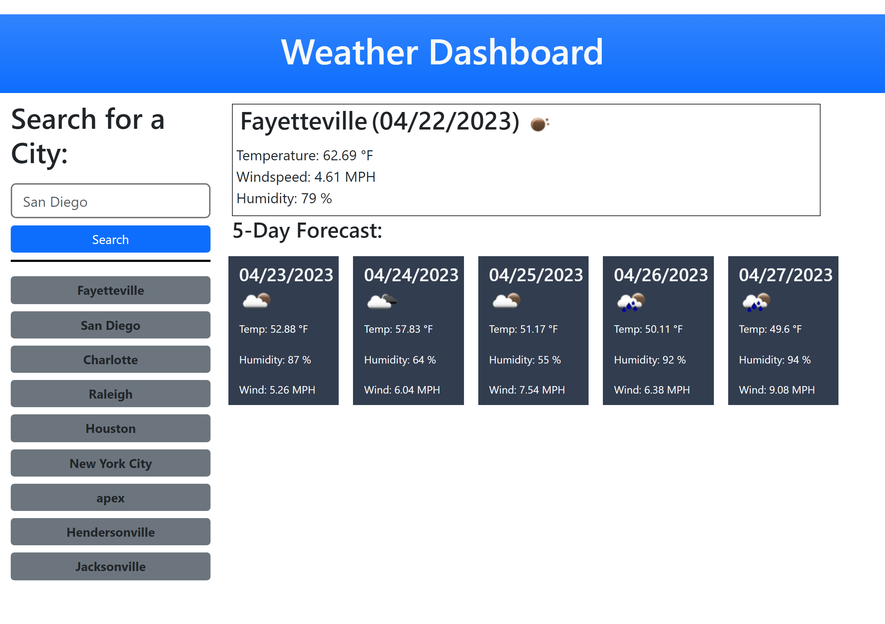

# Weather-Dashboard

## Description

In this project, I created a weather dashboard to display the current weather of the selected city as well as the forecast for the following five days. For this project, I used HTML, CSS, JQuery, Bootstrap, and a third-party API. This project allowed me to practice making network requests to a server and retrieve data from that server using the HTTP protocol. I also had the opportunity to practice more on saving and retrieving data from local storage. 

Some of the problems that I encountered during the development of this application include understanding the data retrieved from the Openweather server, accessing the data, and making use of it. I was able to overcome this by closely examing the documentation provided by Openweather. I learn that it is crucial to refer to the documentation when using third-party APIs, frameworks, applications, etc. I spent extra time trying to convert weather temperatures measured in Kelvin to Fahrenheit. Had I read the documentation more carefully, I would've known that I could just simply request for the temperature measurements in imperial units. 

## Table of Contents (Optional)

N/A

## Installation

None required. Just access HTML, CSS, and JS files to examine the codes.

## Usage

1. Access the repository from https://github.com/Dinh282/weather-dashboard.git. 
2. Clone the repo to the local machine.
3. Examine the index.html file with VS Code using live server extensions. 
4. Type in a city name and click search. 
5. Current day weather and the following 5 days' forecast for the searched city should show on the right.
6. Previously searched cities should be listed on the left. The list should remain
even if the user were to leave and come back. 

Alternatively:
1. Visit https://dinh282.github.io/weather-dashboard/.
Utilize the application as mentioned above.
3. You can also use the inspect tool to examine the source code from the browser as well as the local storage to see what information is stored there.

Image of webpage:

## Credits:

1. https://blog.hubspot.com/website/how-to-override-bootstrap-css (Help with Bootstrap)

2. https://coding-boot-camp.github.io/full-stack/apis/how-to-use-api-keys (Help with understanding API keys)

3. https://www.w3schools.com/js/js_dates.asp (Help with understanding Date Object)

4. https://www.vedantu.com/chemistry/kelvin-scale (Help with Kelvin to Fahrenheit conversion formula).

5. https://codingbeautydev.com/blog/javascript-round-number-to-2-decimal-places/#:~:text=December%2011%2C%202022-,To%20round%20a%20number%20to%202%20decimal%20places%20in%20JavaScript,number%20to%202%20decimal%20places. (Help with .toFixed() method for rounding temperature to 2 decimal places)

6. https://developer.mozilla.org/en-US/docs/Web/JavaScript/Reference/Global_Objects/Date/toLocaleDateString (Help with converting the date to look like the format of the mockup)

7. https://blog.gitguardian.com/leaking-secrets-on-github-what-to-do/?utm_source=alerting&utm_medium=email&utm_campaign=abv10AB (Help with API key leaked on GitHub)

8. https://www.tutorialspoint.com/ajax/what_is_ajax.htm (Help with understanding AJAX)

9. Instructor, TAs, and classmates.

## License

Please refer to the LICENSE section in the repository.

---